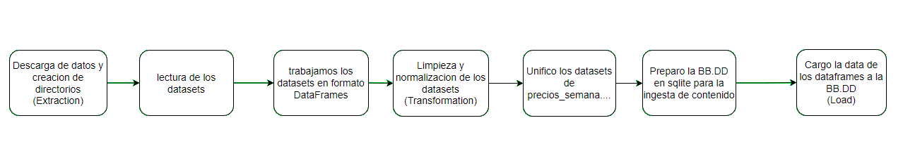
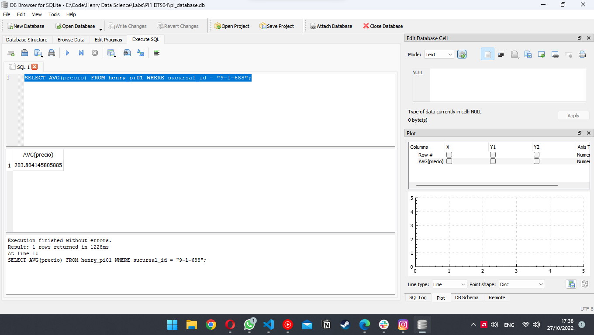

# Proyecto Individual N°1

## Primer paso, setup del entorno
El proyecto lo pense para que fuese 100% pythonico, usando nada mas que pandas y sqlite3. Para que no falte ninguna libreria ejecutar:
```bash
pip install -r requirements.txt
``` 
Version de Python utilizada: 3.10.8.
Como github no permite un repositorio de +25 mb, el entorno debera ser el siguiente o similar:
(La carpeta Raw_Data deberia contener los archivos brindados para realizar el proyecto inicialmente, que refieren a la etapa de extraccion)
(La carpeta Processed_Data se ve alterada tras correr el script)
```
.
├── _src
|   └── _img
|
├── Processed_Data
|
├── Raw_Data
│   ├── precios_semana_20200413.csv
│   ├── precios_semana_20200503.json
│   ├── precios_semana_20200518.txt
│   ├── precios_semana_20200419_20200426.xlsx
│   ├── producto.parquet
│   └── sucursal.csv
|
├── PI.py
|
├── readme.md
|
├── requirements.txt
```

## Segundo paso, normalizacion y transformacion de los datos
Ese paso engloba las lineas 79 hasta 152 en donde busco las irregularidades de los datos a corregir, con sus correspondientes comentarios y documentacion.

## Tercer paso, carga de los datos en la BBDD
Por ultimo cargo los datos con la facilidad que nos brinda pandas hacia sqlite, listo para hacer query.


## Diagrama de flujo del pipeline y resultado final



